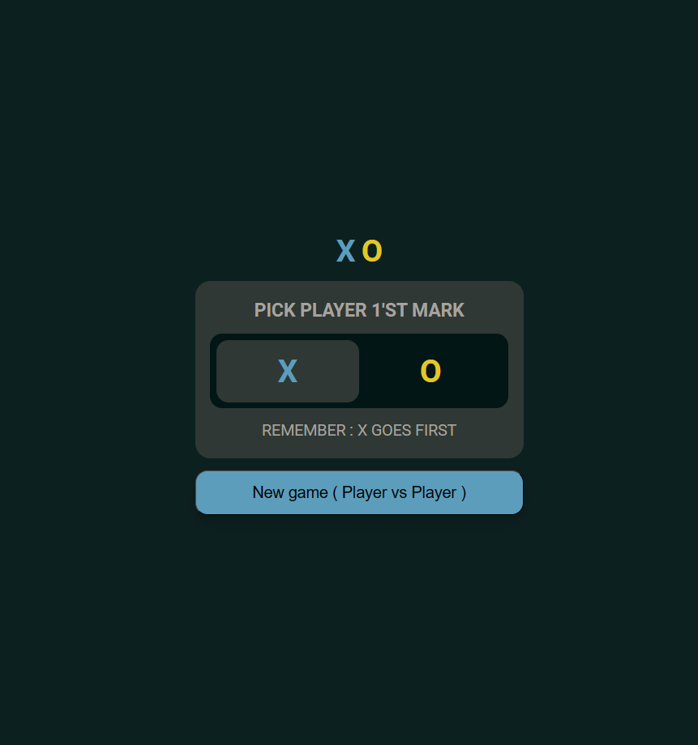
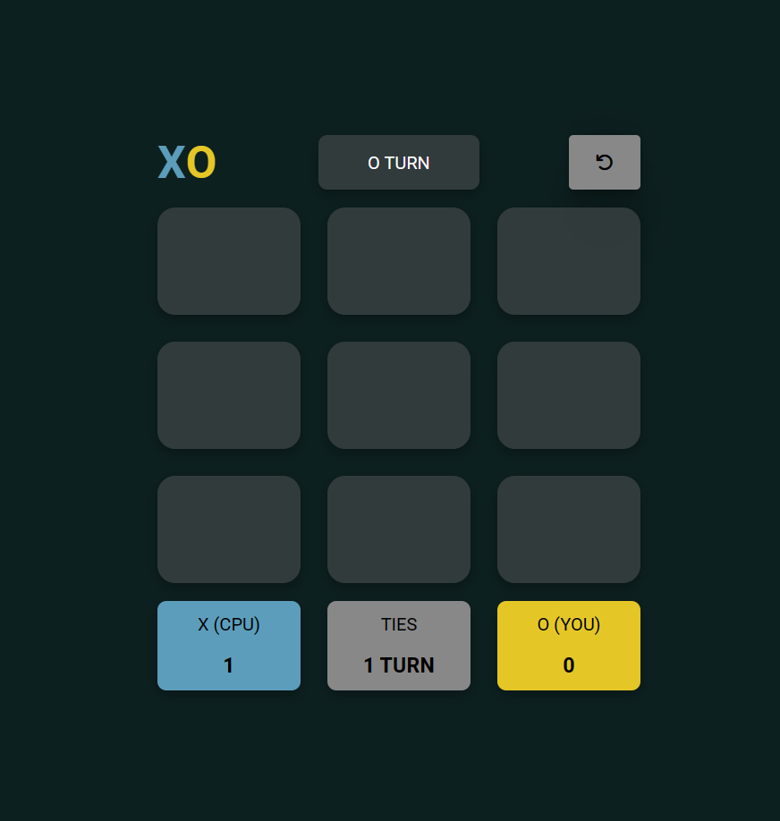
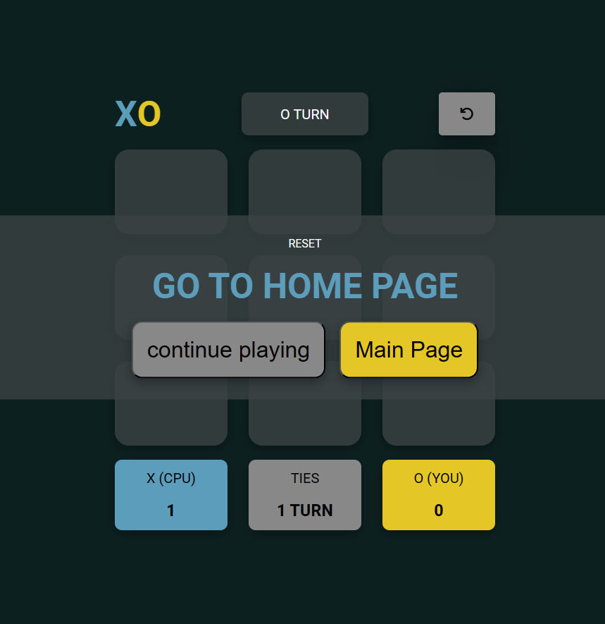
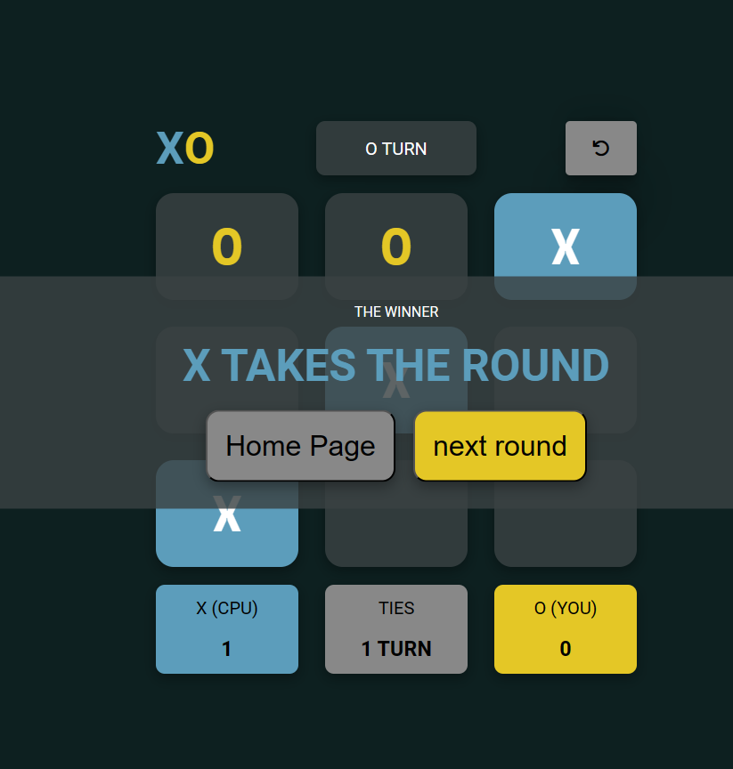

# Tic-Tac-Toe Game

This project is a simple Tic-Tac-Toe game implemented using React and Redux.

## Table of Contents

- [Description](#description)
- [Installation](#installation)
- [Usage](#usage)
- [Features](#features)
- [Contributing](#contributing)
- [Preview](#preview)

## Description

The Tic-Tac-Toe game is a classic two-player game where players take turns to place their marks (X or O) on a 3x3 grid. The goal is to be the first to form a horizontal, vertical, or diagonal line of three marks.


## Installation

To run the Tic-Tac-Toe game locally:

1. Clone this repository to your local machine:

   ```bash
   git clone https://github.com/mustafawardeh/tic-tac-toe-game.git
2. Navigate to the project directory
  cd tic-tac-toe-game
3. Install the required dependencies:
npm install
4.Start the development server:
npm start

5.Open your web browser and go to play the game.

## Usage
<ul>
    <li>Two players can take turns clicking on the grid to place their marks (X or O).</li>
    <li>The game will determine the winner or declare a tie when a player forms a winning combination or when all grid spaces are filled.
  </li>
    <li>You can restart the game at any time by clicking the restart button.
  </li>
</ul>

## Features
<ul>
  <li>Responsive and user-friendly interface.
</li>
  <li>Real-time updates for player turns and game outcomes.
</li>
  <li>Keeps track of the number of wins for each player and ties.
</li>
  <li>Ability to restart the game and start a new round.
</li>
</ul>

## Contributing
Contributions to this project are welcome! If you'd like to contribute:
<ol>
  <li>Fork the repository on GitHub.

</li>
  <li>Make your changes or additions to the code.

</li>
  <li>Test your changes to ensure they work as expected.

</li>
  <li>Submit a pull request with a clear description of your contribution.

</li>
</ol>

## Preview

### Start Page


### Game Page


### Reset Notification


### Winner Notification

